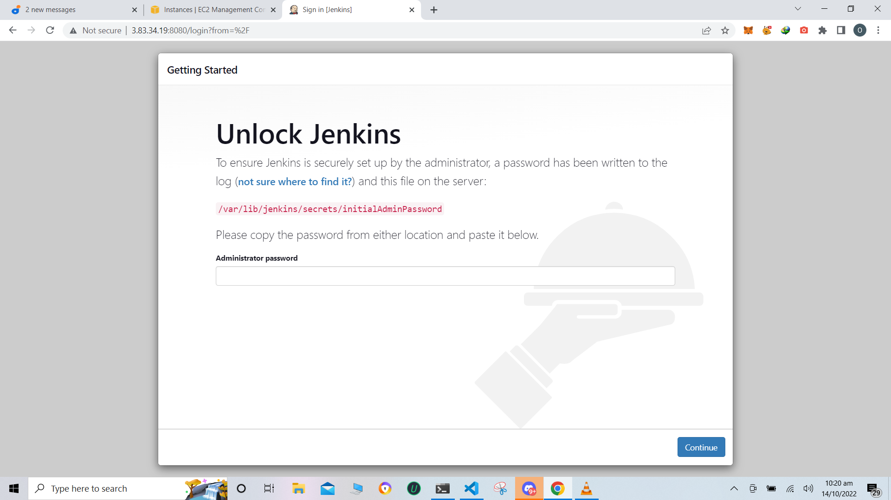
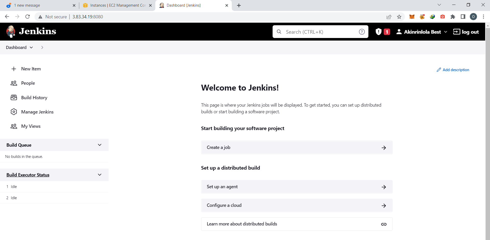
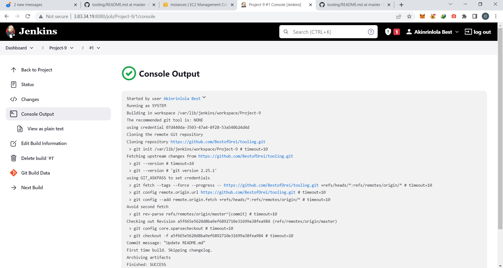
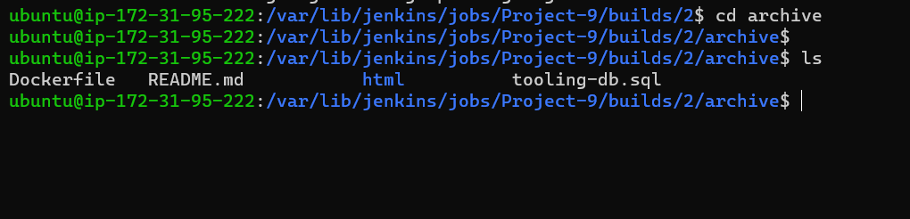
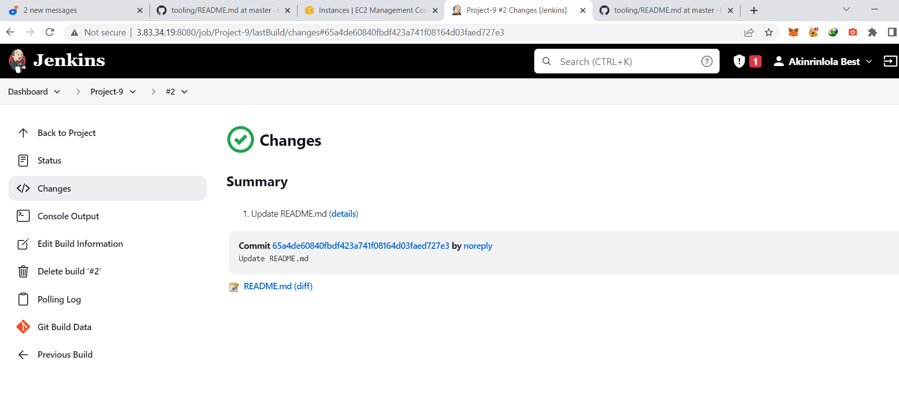
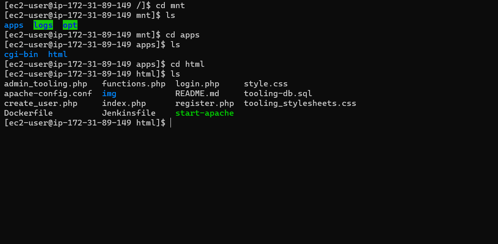

Install jdk

`sudo apt update`
`sudo apt install default-jdk-headless`

Install Jenkins

`wget -q -O - https://pkg.jenkins.io/debian-stable/jenkins.io.key | sudo apt-key add -`

`sudo sh -c 'echo deb https://pkg.jenkins.io/debian-stable binary/ > \  /etc/apt/sources.list.d/jenkins.list'`

`sudo apt update`

`sudo apt-get install jenkins`

`sudo systemctl status jenkins`

Perform initial Jenkins setup.

From your browser access http://
`<Jenkins-Server-Public-IP-Address-or-Public-DNS-Name>:8080`

Retrieve admin pword from your server:

sudo cat /var/lib/jenkins/secrets/initialAdminPassword

## Step 2

1. Enable webhooks in your GitHub repository settings

2. Go to Jenkins web console, click "New Item" and create a "Freestyle project".
To connect your GitHub repository, you will need to provide its URL, you can copy from the repository itself

In configuration of your Jenkins freestyle project choose Git repository, provide there the link to your Tooling GitHub repository and credentials (user/password) so Jenkins could access files in the repository.

Save the configuration and let us try to run the build. For now we can only do it manually.
Click "Build Now" button, if you have configured everything correctly, the build will be successfull and you will see it under #1

3. Click "Configure" your job/project and add these two configurations
Configure triggering the job from GitHub webhook

Configure "Post-build Actions" to archive all the files – files resulted from a build are called "artifacts"

artifacts are stored on Jenkins server locally

`ls /var/lib/jenkins/jobs/tooling_github/builds/<build_number>/archive/`

## Step 3

Configure Jenkins to copy files to NFS server via SSH

1. Install "Publish Over SSH" plugin

2. Configure the job/project to copy artifacts over to NFS server

Scroll down to Publish over SSH plugin configuration section and configure it to be able to connect to your NFS server:

Provide a private key (content of .pem file that you use to connect to NFS server via SSH/Putty)
Arbitrary name
Hostname – can be private IP address of your NFS server
Username – ec2-user (since NFS server is based on EC2 with RHEL 8)
Remote directory – /mnt/apps since our Web Servers use it as a mointing point to retrieve files from the NFS server
Test the configuration and make sure the connection returns Success

Save the configuration, open your Jenkins job/project configuration page and add another one "Post-build Action"

Configure it to send all files probuced by the build into our previouslys define remote directory. In our case we want to copy all files and directories – so we use `**`

